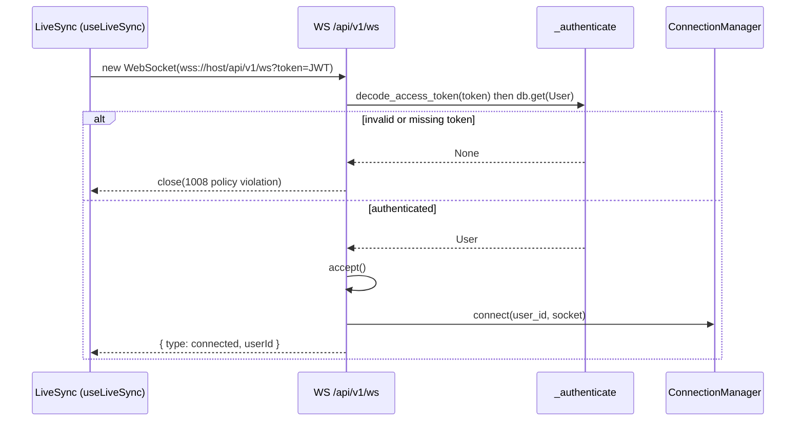
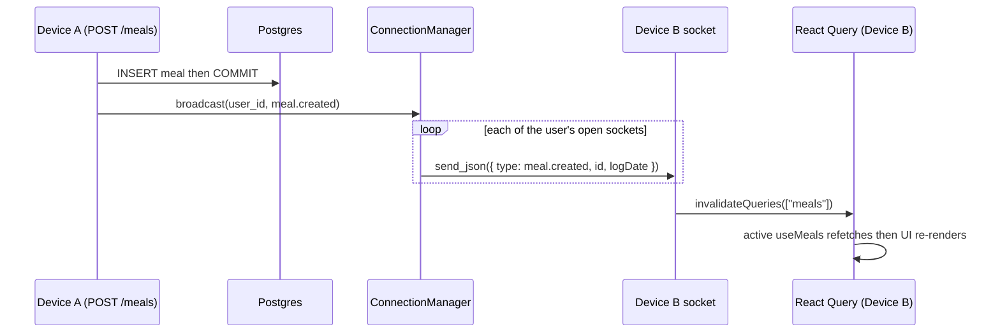

# Chapter 7 — Real-time live-sync over WebSockets

**Last updated:** 2026-07-29 · **Status:** ✅ current with `feat/live-sync-websockets`

Live-sync makes a change on one device appear on the same user's *other* open
tabs/devices with no refresh: log a meal on your phone, and your laptop's "Today"
updates on its own. This chapter traces the whole mechanism — the single
authenticated WebSocket each tab holds, the in-memory registry that groups a
user's sockets, the broadcast fired on a mutation, and the deliberate choice to
push *cache-invalidations* rather than data. Scope today is **meal logs only**;
§7.8 covers extending it.

---

## 7.1 Mental model — one socket per tab, push invalidates the cache

Everything rests on two ideas:

> A tab holds **one persistent WebSocket** for as long as the user is signed in.
> When their data changes anywhere, the server pushes a tiny **event** down every
> socket that user has open. The receiving tab does **not** apply the change from
> the event — it just marks its React Query cache stale, and the *existing* query
> refetches and re-renders.

That second point is the important one. The socket and React Query are not
competitors:

| | **Local mutation** (this tab) | **Live-sync** (another tab) |
|---|---|---|
| Trigger | `useCreateMeal()` succeeds | `meal.*` WS event arrives |
| Then | `invalidateQueries(["meals"])` | `invalidateQueries(["meals"])` |
| Result | list refetches, re-renders | list refetches, re-renders |

Both paths end in the **same** `invalidateQueries` call. Live-sync just gives a
*remote* cause the same effect a *local* mutation already had. The WebSocket
carries a hint ("meals changed"), never the meal itself — so there's no second
copy of server state to keep consistent.

Why a WebSocket at all, and not polling or SSE:

| Approach | Fit | Why |
|---|---|---|
| Polling `GET /meals` on a timer | ✗ | wasteful, laggy, hammers the free-tier backend |
| SSE (server-sent events) | ~ | server→client only; fine for streaming, one-directional |
| **WebSocket** | ✓ | persistent, full-duplex, sub-second push when either side may speak |

---

## 7.2 The state model — an in-memory registry, no database

Unlike reminders (Chapter 3), live-sync stores **nothing in Postgres**. Its only
state is a process-local map of who is connected, in
[ws_manager.py](../../backend/app/services/ws_manager.py):

```
ConnectionManager._connections : dict[int, set[WebSocket]]
                                  user_id  ->  that user's currently-open sockets
```

The other "shape" that matters is the **event** put on the wire — a small typed
JSON object, never the row itself:

```json
{ "type": "meal.created", "id": 42, "logDate": "2026-07-29" }
```

The frontend keys off the `type` prefix (`meal.`) and ignores the rest; `id` /
`logDate` are there for future targeted updates. Because the state is in-memory,
it evaporates on restart (fine — clients reconnect) and does **not** cross
processes (see §7.5, the single-instance limitation).

---

## 7.3 The connect path — the authenticated handshake

A tab opens the socket at load and authenticates in the URL, because **browsers
cannot set an `Authorization` header on a WebSocket handshake** — the JS
`WebSocket` API exposes no way to add headers.



The client builds the URL by reusing the REST origin so the two can't drift —
[use-live-sync.ts](../../frontend/src/lib/use-live-sync.ts) with exports from
[api.ts](../../frontend/src/lib/api.ts):

```ts
function liveSyncUrl(token: string): string {
  const wsBase = API_ORIGIN.replace(/^http/, "ws"); // http->ws, https->wss
  return `${wsBase}${API_V1_PREFIX}/ws?token=${encodeURIComponent(token)}`;
}
```

Server-side, [ws.py](../../backend/app/api/routes/ws.py) authenticates with the
*same* `decode_access_token` the REST routes use, but **returns `None` instead of
raising** — once the connection is upgrading there is no HTTP response to attach
a 401 to, so we reject with a WebSocket close code instead:

```python
async def _authenticate(token: str | None, db: DbSession) -> User | None:
    if not token:
        return None
    try:
        payload = decode_access_token(token)
        user_id = int(payload["sub"])
    except (jwt.PyJWTError, KeyError, ValueError):
        return None
    return await db.get(User, user_id)


@router.websocket("/ws")
async def live_sync(websocket: WebSocket, db: DbSession, token: str | None = None) -> None:
    user = await _authenticate(token, db)
    if user is None:
        await websocket.close(code=status.WS_1008_POLICY_VIOLATION)
        return

    await websocket.accept()
    manager.connect(user.id, websocket)
    await websocket.send_json({"type": "connected", "userId": user.id})

    try:
        while True:
            await websocket.receive_text()   # only used to detect disconnect
    except WebSocketDisconnect:
        pass
    finally:
        manager.disconnect(user.id, websocket)   # always deregister
```

Two load-bearing details: the `while` loop exists **only** to notice a
disconnect (`receive_text` raises `WebSocketDisconnect`), and the `finally`
guarantees the socket always leaves the registry — so we never broadcast into a
dead connection. The route is mounted in
[router.py](../../backend/app/api/router.py), resolving at `/api/v1/ws`.

---

## 7.4 The broadcast path — a mutation reaches the other tab



The mutation side, in [meals.py](../../backend/app/api/routes/meals.py), fires
**after** the commit so the broadcast never advertises a change that isn't
durable:

```python
db.add(meal)
await db.commit()
await db.refresh(meal)
await manager.broadcast(
    current_user.id,
    {"type": "meal.created", "id": meal.id, "logDate": meal.log_date.isoformat()},
)
return meal
```

`update_meal` / `delete_meal` do the same with `meal.updated` / `meal.deleted`
(delete captures `log_date` *before* removing the row). The registry fans it out
in [ws_manager.py](../../backend/app/services/ws_manager.py):

```python
async def broadcast(self, user_id: int, message: dict[str, Any]) -> None:
    for websocket in list(self._connections.get(user_id, ())):
        try:
            await websocket.send_json(message)
        except Exception:
            self.disconnect(user_id, websocket)   # drop a dead socket
```

Iterating a **copy** (`list(...)`) means a socket removed mid-send can't mutate
the set under us. On the receiver, [use-live-sync.ts](../../frontend/src/lib/use-live-sync.ts)
turns the event into an invalidation:

```ts
socket.onmessage = (event) => {
  let data: { type?: string };
  try { data = JSON.parse(event.data); } catch { return; }
  if (data.type?.startsWith("meal.")) {
    queryClient.invalidateQueries({ queryKey: mealsKey });
  }
};
```

`mealsKey` and the `useMeals(start, end)` query it refreshes live in
[use-meals.ts](../../frontend/src/lib/use-meals.ts). Because that query is active
on-screen, invalidation triggers an automatic refetch.

---

## 7.5 Deep dive — lifecycle, reconnect, and the single-instance limit

### Where the hook is mounted

[providers.tsx](../../frontend/src/lib/providers.tsx) renders `<LiveSync/>`
inside `AuthProvider` (so it can read auth) and beside `{children}`.
[live-sync.tsx](../../frontend/src/lib/live-sync.tsx) is a render-null component
whose only job is to run `useLiveSync()` once, confining the `"use client"`
boundary to that tiny file (per Next's guidance).

### Reconnect with capped backoff

Render's free tier drops idle sockets and networks flap, so the hook reconnects
itself — but must not fight React or reconnect on every user-object refresh:

```ts
export function useLiveSync(): void {
  const { user } = useAuth();
  const userId = user?.id;               // stable dep: reconnect on login/logout only
  const queryClient = useQueryClient();

  useEffect(() => {
    if (!userId) return;
    let socket: WebSocket | null = null;
    let reconnectTimer: ReturnType<typeof setTimeout> | undefined;
    let attempts = 0;
    let closedByUs = false;

    const connect = () => {
      const token = tokenStore.get();
      if (!token) return;
      socket = new WebSocket(liveSyncUrl(token));
      socket.onopen = () => { attempts = 0; };            // reset backoff
      socket.onmessage = handleMealEvent;                 // invalidate meals cache — see §7.4
      socket.onclose = () => {
        if (closedByUs) return;                            // unmount/logout
        const delay = Math.min(30_000, 1_000 * 2 ** attempts);  // 1s,2s,4s… cap 30s
        attempts += 1;
        reconnectTimer = setTimeout(connect, delay);
      };
    };

    connect();
    return () => { closedByUs = true; clearTimeout(reconnectTimer); socket?.close(); };
  }, [userId, queryClient]);
}
```

`closedByUs` distinguishes an *intentional* close (unmount / logout — don't
reconnect) from a *dropped* one (reconnect). `userId` as the dependency means a
routine `refreshUser()` that returns a new user object won't needlessly tear the
socket down.

### The single-instance limitation (the deliberate lesson)

The registry lives in **one process**. With more than one backend replica, a
broadcast only reaches sockets connected to the *same* replica — the others miss
it. This is the exact same limitation as the reminder dispatch loop's in-process
`asyncio.Event` (Chapter 3, §3.5). It's fine on the single Render free instance;
a multi-replica deploy would need shared pub/sub (e.g. Redis) to fan events
across processes. Documented in `ws_manager.py` and revisited in §7.8.

---

## 7.6 How to run & test it

- **Manual (local):** run backend + frontend, sign in on **two browser windows**
  on the same day-view, log a meal in one → it appears in the other. Confirm the
  socket in DevTools → Network → filter **WS**: a `101` connection to
  `…/api/v1/ws` with a `{ "type": "connected" }` frame under Messages.
- **Cross-device (phone ↔ laptop):** needs a deploy — Render free has no backend
  preview environments, so `/api/v1/ws` is only reachable once the code is on the
  branch Render deploys (master). The frontend derives `wss://` from
  `NEXT_PUBLIC_API_URL` automatically; no extra env var.
- **Automated:** [test_ws.py](../../backend/tests/test_ws.py) covers auth
  accept/reject (with a fake `get_db`, no Postgres) and **per-user isolation** —
  both of Alice's tabs receive a broadcast, Bob's does not:

```python
def test_broadcast_reaches_only_that_users_sockets():
    async def scenario():
        mgr = ConnectionManager()
        alice_tab1, alice_tab2, bob_tab = _FakeWS(), _FakeWS(), _FakeWS()
        mgr.connect(1, alice_tab1); mgr.connect(1, alice_tab2); mgr.connect(2, bob_tab)
        await mgr.broadcast(1, {"type": "meal.created", "id": 7})
        assert alice_tab1.sent and alice_tab2.sent and bob_tab.sent == []
    asyncio.run(scenario())
```

> Unlike the async-SQLAlchemy engine (Chapter 3 gotcha), Starlette's
> `TestClient.websocket_connect` works fine here because the WS auth path is
> stubbed with a fake session — no real event-loop/DB contention.

---

## 7.7 Gotchas learned

- **Browsers can't set headers on a WebSocket.** Hence `?token=` in the URL, not
  `Authorization: Bearer`. Validate it the same way regardless.
- **Reject with a close code, not an HTTP 401.** Once upgrading, there's no HTTP
  response left — `_authenticate` returns `None` and the endpoint `close(1008)`s.
- **`finally` must deregister.** Any exit path (disconnect, error) has to remove
  the socket, or a later broadcast writes into a dead connection.
- **`meal` ≠ `dish`.** Live-sync is wired on `/meals` (meal logs), **not**
  `/dishes` (the food library). Editing a dish on one device does *not* sync —
  it simply has no `broadcast()` call yet. Common source of "it's not working."
- **Render free cold start.** After ~15 min idle the service sleeps; the first
  hit takes 30–60s and a silent socket may drop. The backoff reconnects once the
  service is awake.
- **FastAPI hides WS routes in `_IncludedRouter`.** `app.routes` won't show the
  route as a top-level `APIWebSocketRoute` (it's nested under an include wrapper).
  The route still works — trust the passing test, not a shallow route dump.

---

## 7.8 Future enhancements

Roughly ordered by value-to-effort:

1. **Extend to the other Today entities.** Same pattern: `broadcast()` on the
   dishes / notes / reminders mutations, and handle `dish.*` / `note.*` /
   `reminder.*` in `useLiveSync` (invalidate `dishesKey`, etc.). Small, and the
   most-requested gap.
2. **Heartbeat ping.** A ~25s client ping (and/or server keepalive) keeps the
   socket — and the Render instance — from going idle, and detects half-open
   connections faster than TCP timeouts.
3. **Multi-replica correctness (Redis pub/sub).** Replace the in-process registry
   fan-out with a shared broker so a broadcast on any replica reaches sockets on
   all of them. This is the same fix reminders would need (Chapter 3, §3.8 #4) —
   and the concrete requirement behind the parked Kubernetes track in
   [BUILD-PLAN.md](../BUILD-PLAN.md).
4. **Targeted updates instead of blanket invalidation.** The event already
   carries `id` / `logDate`; a receiver could `setQueryData` to patch just the
   affected day rather than refetch the whole range.
5. **Token refresh on reconnect.** The socket reads `tokenStore.get()` per
   connect attempt, so a rotated token is picked up on reconnect — but a
   long-lived socket won't notice an expired token until it drops. A periodic
   re-auth or server-driven `reauth` frame would close that gap.
6. **Presence / "editing elsewhere" UX.** The registry already knows how many
   sockets a user has open; surfacing that enables "open on 2 devices" hints.
