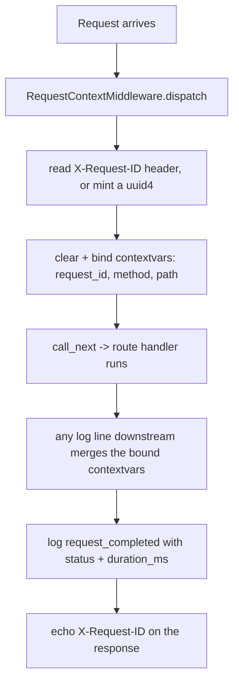

# Chapter 8 — Observability: structured logs, request IDs & health probes

**Last updated:** 2026-07-30 · **Status:** ✅ current with `feat/observability-logging`

**Why we did this.** Until now the app logged almost nothing on purpose: a few
scattered `logging.getLogger(__name__)` calls riding uvicorn's default handler,
and a single `/health` endpoint. The moment anything misbehaves in the deployed
app, you're blind — you can't tell *which* request failed, or *why*, or whether
the process is even healthy. This is the foundation slice for everything after
it: you can't debug real-time sync, background jobs, or slow AI calls if you
can't see them.

**What the feature does.** Three things:

1. **Structured logging** — every log line, from *any* source (our code,
   uvicorn, SQLAlchemy), is rendered through one pipeline: pretty coloured lines
   in development, one JSON object per line in production.
2. **Request correlation** — every HTTP request gets a `request_id` that is
   stamped onto *every* log line it produces and echoed back in a response
   header, so you can grep one id and reconstruct the whole request.
3. **Liveness vs. readiness** — `/health` (is the process alive?) is split from
   `/health/ready` (can it actually serve — is the database reachable?).

---

## 8.1 Mental model — one pipeline, one id per request

Two ideas carry the whole chapter:

> **A log line is a structured event, not a string.** Instead of
> `logger.info(f"meal {id} created")` you emit `logger.info("meal_created",
> meal_id=id)` — an event name plus key/value fields. In production that becomes
> JSON a machine can filter (`level="error"`, `path="/api/v1/meals"`); in dev it
> becomes a readable coloured line. Same call, two renderings.

> **Everything a single request does shares one `request_id`.** A middleware
> assigns it once at the edge and binds it into a `contextvars` context; every
> log line emitted anywhere downstream — in our handlers, in uvicorn's access
> log — automatically carries it. One request, one thread of logs you can pull.

The key design choice is **unification**: rather than bolting structlog on
*next to* the standard library's `logging`, we route stdlib logging *through*
structlog's renderer. That's why uvicorn's own startup and access lines come out
as JSON too, without rewriting a single uvicorn call.

---

## 8.2 The pieces

| Concern | File |
|---|---|
| Settings (`environment`, `log_level`) | [config.py](../../backend/app/core/config.py) |
| Logging pipeline (`configure_logging`) | [logging.py](../../backend/app/core/logging.py) |
| Request id + access log middleware | [middleware.py](../../backend/app/api/middleware.py) |
| Liveness / readiness endpoints | [health.py](../../backend/app/api/routes/health.py) |
| Wiring (configure first, add middleware) | [main.py](../../backend/app/main.py) |

Two new settings drive it: `environment` (`development` → console renderer,
`production` → JSON renderer) and `log_level` (root level for app + deps).

---

## 8.3 The flow — a request, start to finish



At startup, `create_app()` calls `configure_logging()` **first**, before
anything can log, so uvicorn's own handlers are stripped and replaced by ours:

```python
def create_app() -> FastAPI:
    # Configure logging first, before anything in the app has a chance to log.
    configure_logging()
    ...
    app.add_middleware(RequestContextMiddleware)  # outermost: id assigned first
```

Per request, the middleware binds the correlation context, times the call, and
logs one access line:

```python
request_id = request.headers.get(REQUEST_ID_HEADER) or uuid.uuid4().hex
structlog.contextvars.clear_contextvars()
structlog.contextvars.bind_contextvars(request_id=request_id, method=..., path=...)
...
logger.info("request_completed", status_code=response.status_code, duration_ms=...)
response.headers[REQUEST_ID_HEADER] = request_id
```

Because the id lives in `contextvars`, *nothing else has to pass it around* —
`structlog.contextvars.merge_contextvars` (a processor in the pipeline) folds it
into every event automatically.

---

## 8.4 The tricky part — unifying structlog *and* stdlib

The goal: our `structlog.get_logger(...)` calls **and** third-party
`logging.getLogger(...)` calls (uvicorn, SQLAlchemy) all come out identical.
`structlog.stdlib.ProcessorFormatter` is the bridge. In
[logging.py](../../backend/app/core/logging.py):

```python
# structlog-native records: run the shared chain, then hand off to the stdlib
# formatter instead of rendering here.
structlog.configure(
    processors=[*_SHARED_PROCESSORS,
                structlog.stdlib.ProcessorFormatter.wrap_for_formatter],
    logger_factory=structlog.stdlib.LoggerFactory(),
    wrapper_class=structlog.stdlib.BoundLogger,
)

# The one stdlib formatter that actually renders. foreign_pre_chain gives records
# that came from plain logging (uvicorn, SQLAlchemy) the same processing.
formatter = structlog.stdlib.ProcessorFormatter(
    foreign_pre_chain=_SHARED_PROCESSORS,
    processors=[structlog.stdlib.ProcessorFormatter.remove_processors_meta, renderer],
)
```

Both paths converge on the same `renderer` (`JSONRenderer` in prod,
`ConsoleRenderer` in dev). We also strip uvicorn's own handlers and set
`propagate = True` so its lines flow to our root handler instead of being printed
twice in its default format.

The payoff, verified live in production mode — uvicorn's access line inherits our
`request_id` even though uvicorn knows nothing about our middleware:

```json
{"event": "request_completed", "request_id": "my-trace-1", "path": "/api/v1/health", "status_code": 200, "duration_ms": 1.0, "level": "info", ...}
{"event": "127.0.0.1 - \"GET /api/v1/health HTTP/1.1\" 200", "request_id": "my-trace-1", ...}
```

---

## 8.5 Liveness vs. readiness — and why they must differ

A probe answers one of two very different questions, and conflating them causes
restart loops:

- **Liveness** (`/health`) — "is this process alive?" It must **never** touch the
  database. If it did, a brief DB blip would make the platform *kill* an
  otherwise-fine container, turning a 2-second hiccup into a crash loop.
- **Readiness** (`/health/ready`) — "can this instance serve traffic *right
  now*?" It runs a trivial `SELECT 1`; on failure it returns **503** so a load
  balancer / Kubernetes readiness probe stops routing here until the dependency
  recovers — *without* killing the process.

```python
try:
    await db.execute(text("SELECT 1"))
except Exception:
    logger.warning("readiness_check_failed", check="database", exc_info=True)
    return JSONResponse(status_code=503, content=ReadinessResponse(
        status="not ready", checks={"database": "unreachable"}).model_dump())
```

Render's `healthCheckPath` is `/api/v1/health` (liveness) — correct: a DB blip
won't restart the container. The future Kubernetes track points its *readiness*
probe at `/health/ready`. The `checks` map has room for more dependencies
(Redis, etc.) as they arrive.

---

## 8.6 How to run & test

```bash
cd backend
# Dev: pretty coloured lines
uv run python -m uvicorn app.main:app --reload --port 8000
# Prod: one JSON object per line
ENVIRONMENT=production uv run python -m uvicorn app.main:app --port 8000

curl -H "X-Request-ID: my-trace-1" localhost:8000/api/v1/health   # id echoes back
curl localhost:8000/api/v1/health/ready                            # 200 ready / 503 not ready
```

Tests live in [test_request_context.py](../../backend/tests/test_request_context.py)
(the id is always present, honours an inbound id, unique per request) and
[test_health.py](../../backend/tests/test_health.py) (readiness 200/503 and
liveness-independent-of-DB, via a dependency-override fake session — no real
Postgres needed).

---

## 8.7 Gotchas

- **`ENVIRONMENT=production` must be set on Render** or prod logs render as dev
  console lines instead of JSON.
- **`configure_logging()` must run before anything logs** — hence it's the first
  line of `create_app()`, and it clears existing handlers to win over uvicorn.
- **`ConsoleRenderer` emits ANSI colour codes**; piping dev logs to a file gives
  you escape sequences. That's expected — production (JSON) is the machine path.
- **Middleware order**: `RequestContextMiddleware` is added *last* so it's the
  outermost layer and assigns the id before any other middleware runs.

---

## 8.8 Future enhancements

- **Sentry** (A1.3) — capture unhandled exceptions, tagged with the `request_id`
  bound here so an error links straight to its request's logs.
- **OpenTelemetry tracing** (A1.4) — auto-instrument FastAPI + SQLAlchemy + the
  Gemini HTTP calls to see *where* the AI latency actually goes.
- **Richer readiness** — add a Redis check to the `checks` map once Redis lands.

See [BUILD-PLAN.md](../BUILD-PLAN.md) → *R5 — "It's production"* for the full arc.
